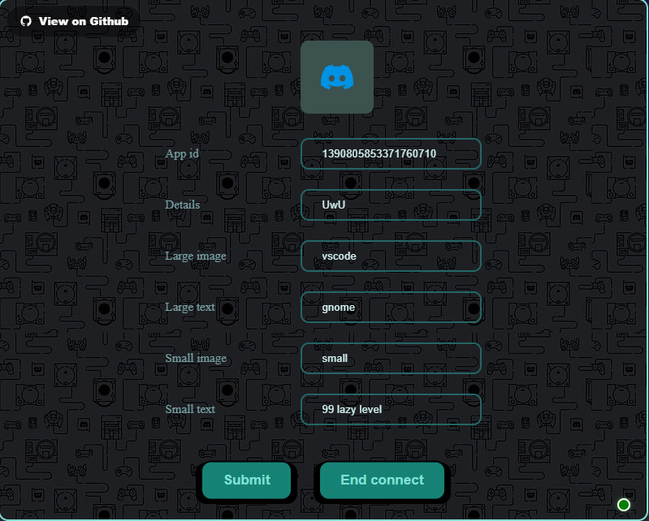

# DiscordStatusKit

DiscordStatusKit is a simple utility that helps you build and manage custom Discord Rich Presence statuses. The app is fully bundled with Python and dependencies — no setup needed.

## 🧰 What You Can Do

- Input:
  - App ID
  - Details
  - Large/Small Image keys and their tooltips
- One-click connect and disconnect
- See live presence changes instantly
- Connection indicator built-in

## 🚀 Launching

- Grab the installer or portable version from [Releases](https://github.com/Ar0cka/FakeStatusRTC/releases)
- Run it — that’s it.

✅ No Python installation required.

## 🧪 Creating a Discord Developer Application

1. Go to [Discord Developer Portal](https://discord.com/developers/applications)
2. Click “New Application”, set a name, create it
3. Open **Rich Presence > Art Assets**
4. Upload images (case-sensitive names!)
5. Copy your **Client ID** — it’s your App ID
6. Make sure Discord is running locally

💡 This presence will be visible to **all** users, just like game activity.

## 📸 Screenshots
Interface Preview:

  -

Displayed Result

  -.png)

## 🔗 Useful Links

- [Discord Developer Portal](https://discord.com/developers/applications)
- [pypresence Docs](https://qwertyquerty.github.io/pypresence/html/index.html)
